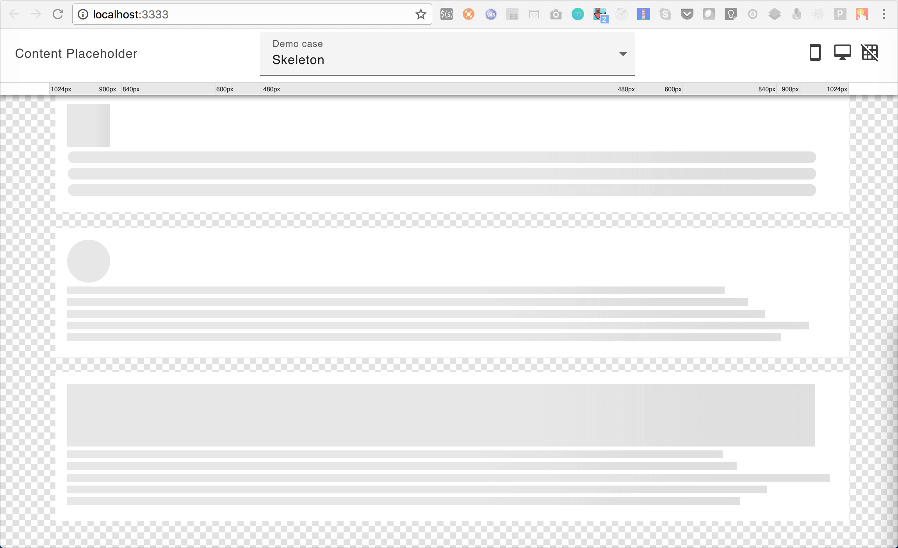

![Built With Stencil](https://img.shields.io/badge/-Built%20With%20Stencil-16161d.svg?logo=data%3Aimage%2Fsvg%2Bxml%3Bbase64%2CPD94bWwgdmVyc2lvbj0iMS4wIiBlbmNvZGluZz0idXRmLTgiPz4KPCEtLSBHZW5lcmF0b3I6IEFkb2JlIElsbHVzdHJhdG9yIDE5LjIuMSwgU1ZHIEV4cG9ydCBQbHVnLUluIC4gU1ZHIFZlcnNpb246IDYuMDAgQnVpbGQgMCkgIC0tPgo8c3ZnIHZlcnNpb249IjEuMSIgaWQ9IkxheWVyXzEiIHhtbG5zPSJodHRwOi8vd3d3LnczLm9yZy8yMDAwL3N2ZyIgeG1sbnM6eGxpbms9Imh0dHA6Ly93d3cudzMub3JnLzE5OTkveGxpbmsiIHg9IjBweCIgeT0iMHB4IgoJIHZpZXdCb3g9IjAgMCA1MTIgNTEyIiBzdHlsZT0iZW5hYmxlLWJhY2tncm91bmQ6bmV3IDAgMCA1MTIgNTEyOyIgeG1sOnNwYWNlPSJwcmVzZXJ2ZSI%2BCjxzdHlsZSB0eXBlPSJ0ZXh0L2NzcyI%2BCgkuc3Qwe2ZpbGw6I0ZGRkZGRjt9Cjwvc3R5bGU%2BCjxwYXRoIGNsYXNzPSJzdDAiIGQ9Ik00MjQuNywzNzMuOWMwLDM3LjYtNTUuMSw2OC42LTkyLjcsNjguNkgxODAuNGMtMzcuOSwwLTkyLjctMzAuNy05Mi43LTY4LjZ2LTMuNmgzMzYuOVYzNzMuOXoiLz4KPHBhdGggY2xhc3M9InN0MCIgZD0iTTQyNC43LDI5Mi4xSDE4MC40Yy0zNy42LDAtOTIuNy0zMS05Mi43LTY4LjZ2LTMuNkgzMzJjMzcuNiwwLDkyLjcsMzEsOTIuNyw2OC42VjI5Mi4xeiIvPgo8cGF0aCBjbGFzcz0ic3QwIiBkPSJNNDI0LjcsMTQxLjdIODcuN3YtMy42YzAtMzcuNiw1NC44LTY4LjYsOTIuNy02OC42SDMzMmMzNy45LDAsOTIuNywzMC43LDkyLjcsNjguNlYxNDEuN3oiLz4KPC9zdmc%2BCg%3D%3D&colorA=16161d&style=flat-square)
[](https://coveralls.io/github/o-rango/o-content-placeholder?branch=master)
[](https://travis-ci.org/o-rango/o-content-placeholder)


# o-content-placeholder [Demo](https://o-rango.github.io/o-content-placeholder/)
 Simple and customizable content placeholder built as web component with Stenciljs :metal:
## Getting Started


### Demo Version 


To try this component:

```bash
npm i --save @o-rango/o-content-placeholder
```


```html

// Add script tag to your page

<script src="./node_modules/@o-rango/o-content-placeholder/dist/o-content-placeholder.js"></script>
// OR
<script src="https://unpkg.com/@o-rango/o-content-placeholder/dist/o-content-placeholder.js"></script>
```

And compose your content placeholder with `<o-content-placeholder-img>`  or  `</o-content-placeholder-block>`

```html
  <o-content-placeholder-img size="55" animate="true" format="square"></o-content-placeholder-img>
  <o-content-placeholder-block rounded="true" line-height="15" margin="6" animate="true" lines="3"></o-content-placeholder-block>
  <o-content-placeholder-img size="55" animate="false" format="circle"></o-content-placeholder-img>
```


Properties

```html

//o-content-placeholder-block
@Prop() animate: boolean = false;
@Prop() lines: number = 1;
@Prop() lineHeight: number = 15;
@Prop() margin: number = 5;
@Prop() randomSize: boolean = false;
@Prop() rounded: boolean = false;

//o-content-placeholder-img
@Prop() animate: boolean = false;
@Prop() format: 'circle' | 'square' = 'square';
@Prop() size: number = 55;

```